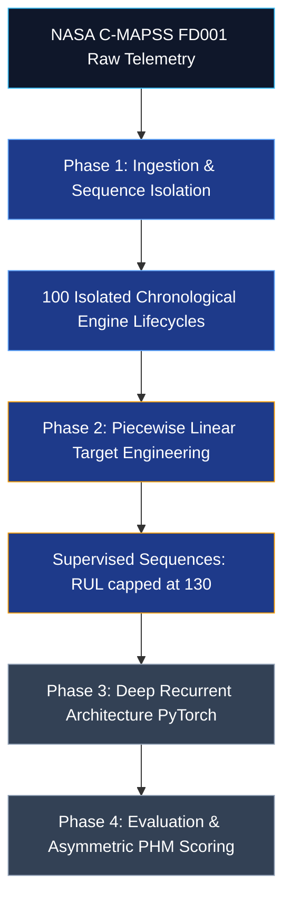

# Rebuilding Heimes (2008): Turbofan Remaining Useful Life (RUL) Estimation

[](https://www.python.org/)
[](https://pytorch.org/)
[](https://ti.arc.nasa.gov/tech/dash/groups/pcoe/prognostic-data-repository/)
[](#)

A complete, domain-first re-implementation of **Felix O. Heimes' (2008)** award-winning Recurrent Neural Network (RNN) architecture for Prognostics and Health Management (PHM), built from scratch using clean Python and PyTorch on the **NASA C-MAPSS FD001** turbofan engine dataset.

---

## 📌 Global Project Vision & Core Principles

When building Predictive Maintenance and Engine Health Management (EHM) models on industrial sensor streams, off-the-shelf tabular machine learning workflows often disregard underlying thermodynamic realities. This repository reconstructs the complete engineering and deep learning pipeline from Heimes (2008) under three core principles:

1. **Thermodynamic Causal Continuity**: Engine wear is cumulative and path-dependent. Data rows are never shuffled across fleet units; every asset's lifecycle is preserved as an isolated chronological trajectory.
2. **Implicit Health Inference**: We deliberately strip explicit ticking clocks (`cycle_number`) from the feature matrix so the neural network learns degradation implicitly from gas-path thermodynamic variables (temperatures, pressures, rotor speeds).
3. **Physically Grounded Supervision**: Linear RUL targets fail during early steady-state operation. We implement Heimes' **Piecewise Linear Target Function** ($RUL_{\max} = 130$ cycles) to supervise models accurately across early stable and observable wear regimes.

---

## 🏗️ End-to-End System Architecture



---

## 🗺️ Project Navigation & Phase Documentation

Each phase of the project is structured modularly with its own dedicated documentation and verification suite:

| Phase | Module / Documentation | Core Focus & Engineering Deliverable | Status |
| :--- | :--- | :--- | :---: |
| **Phase 1** | [`README_Phase_1.md`](file:///d:/Study/EHM/cmapss_project/README_Phase_1.md) <br/> Script: `phase_1.py` | **Data Ingestion & Sequence Isolation**: Space-separated C-MAPSS parsing, 26-column schema assignment, 100 isolated engine lifecycles ($t_{EOL} \in [128, 362]$). | ✅ **Complete** |
| **Phase 2** | *Phase 2 Documentation* <br/> Script: `phase_2.py` *(Upcoming)* | **Target Label Engineering**: Implementing Heimes' Piecewise Linear Target Function ($RUL_{\max} = 130$) to prevent early-regime gradient noise. | ⏳ *Upcoming* |
| **Phase 3** | *Phase 3 Documentation* | **Recurrent Neural Network Architecture**: Designing and building the multi-layer PyTorch RNN/LSTM architecture from scratch. | ⏳ *Planned* |
| **Phase 4** | *Phase 4 Documentation* | **Training, Diagnostics & Horizon Evaluation**: Evaluating predictions against the asymmetric PHM 2008 scoring function. | ⏳ *Planned* |

---

## 🚀 Running the Project Locally

### Prerequisites
Install the core scientific Python and PyTorch stack:
```bash
pip install pandas numpy torch matplotlib
```

### Local Execution (Spyder / VS Code / Terminal)
Open the project directory in **Spyder** (or your local IDE) and run individual phase scripts directly:
```bash
# Phase 1: Execute data ingestion & sequence isolation checks
python phase_1.py
```

---

## 📖 Key References & Citations
1. **Heimes, F. O. (2008)**. *"Recurrent neural networks for remaining useful life estimation"*. In *2008 International Conference on Prognostics and Health Management* (PHM), IEEE.
2. **Saxena, A., Goebel, K., Simon, D., & Eklund, N. (2008)**. *"Damage propagation modeling for aircraft engine run-to-failure simulation"*. In *2008 International Conference on Prognostics and Health Management* (PHM), IEEE.
